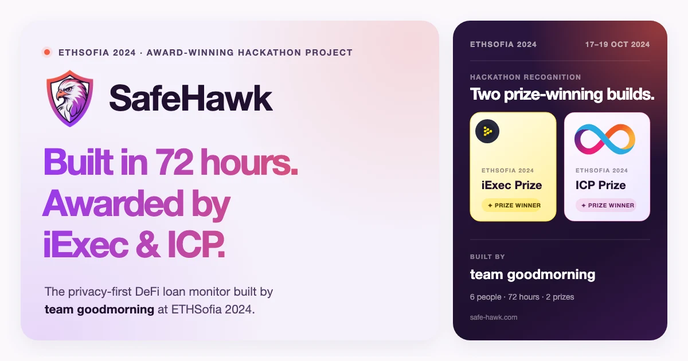

# SafeHawk

SafeHawk is a privacy-first DeFi loan monitor built in 72 hours by
[team goodmorning](https://goodmorning.dev) at ETHSofia 2024. The project won
prizes from both iExec and Internet Computer (ICP).

The product combines a live AAVE position dashboard, privacy-preserving weekly
email updates powered by iExec DataProtector and Web3Mail, and a browser
extension for real-time health-factor monitoring.



## Project status

SafeHawk is no longer under active product development. The repository and
website are maintained as a working archive of the hackathon build, the product
thinking, and the team behind it. The dashboard and view-only flow remain
available, but the project's primary purpose is now to preserve and present the
work rather than operate it as an actively developed product.

The hackathon deployment originally ran on ICP. The website is now hosted on
GitHub Pages.

-   [Live project](https://safe-hawk.com)
-   [Original ETHSofia 2024 submission on DoraHacks](https://dorahacks.io/buidl/17699/)
-   [Original demo](https://www.youtube.com/watch?v=RH0YMLWF-KQ)

The frontend is a React and TypeScript application originally bootstrapped with
[Create React App](https://github.com/facebook/create-react-app). The technical
operations and development instructions below are kept for anyone running or
studying the project.

## Web3Mail operations

SafeHawk uses `@iexec/web3mail` on Arbitrum One (chain ID `42161`) to create
privacy-preserving email tasks. Users protect their email and grant access to
the SafeHawk sender from the dashboard.

Copy `env.sample` to `.env` and configure:

-   `PRIVATE_KEY` and `REACT_APP_EMAIL_ACCOUNT_ADDRESS` for the same sender wallet.
-   `IEXEC_RPC_URL` with an Arbitrum One RPC URL or `arbitrum-mainnet`.
-   The maximum accepted prices in nRLC. The default workerpool ceiling is
    `100000000` nRLC (`0.1 RLC`) per email task.

The sender needs:

1. ETH on Arbitrum One for transaction gas.
2. RLC on Arbitrum One.
3. RLC deposited into its iExec protocol account before sending paid tasks.

After buying RLC into the sender wallet, deposit the desired amount into the
iExec protocol account (this sends an Arbitrum transaction):

```bash
yarn web3mail:deposit 1
```

Run the read-only status check before sending:

```bash
yarn web3mail:status
```

It reports the sender address, ETH/RLC wallet balances, deposited and locked
RLC, contact count, live app/workerpool prices, and whether the configured price
ceiling can cover them.

Protected email data from the retired Bellecour network is not available on
Arbitrum. After deploying the updated frontend, existing users must open the
dashboard once and save/grant access to their email again.

The AAVE dashboard uses unauthenticated public RPC endpoints defined in
`src/common/networks.ts`.

Run the email job manually, including outside Monday:

```bash
FORCE_SEND_EMAILS=1 ./bin/send-emails.sh
```

Logs are structured JSON. A successful `web3mail.task.created` event means the
task was accepted on-chain; it does not yet guarantee email delivery. Inspect a
task with:

```bash
npx iexec task debug <TASK_ID> --chain arbitrum-mainnet
npx iexec task debug <TASK_ID> --chain arbitrum-mainnet --logs --wallet-file <wallet.json>
```

When running from cron, persist stdout and stderr in the platform logging system
or redirect them to a rotated log file.

## Available Scripts

In the project directory, you can run:

### `yarn start`

Runs the app in the development mode.\
Open [http://localhost:3000](http://localhost:3000) to view it in the browser.

The page will reload if you make edits.\
You will also see any lint errors in the console.

### `yarn test`

Launches the test runner in the interactive watch mode.\
See the section about [running tests](https://facebook.github.io/create-react-app/docs/running-tests) for more information.

### `yarn build`

Builds the app for production to the `build` folder.\
It correctly bundles React in production mode and optimizes the build for the best performance.

The build is minified and the filenames include the hashes.\
Your app is ready to be deployed!

See the section about [deployment](https://facebook.github.io/create-react-app/docs/deployment) for more information.

### `yarn eject`

**Note: this is a one-way operation. Once you `eject`, you can’t go back!**

If you aren’t satisfied with the build tool and configuration choices, you can `eject` at any time. This command will remove the single build dependency from your project.

Instead, it will copy all the configuration files and the transitive dependencies (webpack, Babel, ESLint, etc) right into your project so you have full control over them. All of the commands except `eject` will still work, but they will point to the copied scripts so you can tweak them. At this point you’re on your own.

You don’t have to ever use `eject`. The curated feature set is suitable for small and middle deployments, and you shouldn’t feel obligated to use this feature. However we understand that this tool wouldn’t be useful if you couldn’t customize it when you are ready for it.

## Learn More

You can learn more in the [Create React App documentation](https://facebook.github.io/create-react-app/docs/getting-started).

To learn React, check out the [React documentation](https://reactjs.org/).
